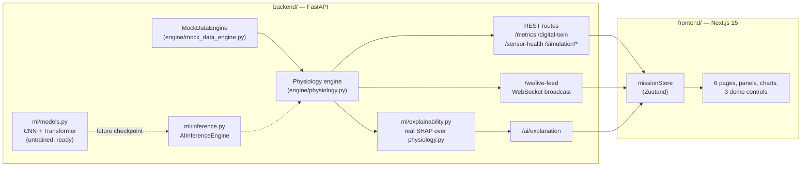

# Biological Minimalism

**AI-Driven Minimal Sensor Architecture for Autonomous Astronaut Health Monitoring**

A NASA Mission Control–styled dashboard demonstrating how a four-sensor wearable
suite (wireless EEG, PPG, peripheral temperature, bio-impedance), fused by a
CNN + Transformer architecture into a personalized **Biological Digital Twin**,
can recover the physiological picture that today's multi-sensor (up to
12-sensor) astronaut monitoring setups provide — with genuine, locally-computed
SHAP explainability instead of a black box.

Built for the **77th International Astronautical Congress (IAC 2026)**, Antalya,
Türkiye — IAF/IAA Space Life Sciences Symposium, Interactive Presentation format.

> **Read this first:** [`docs/PDD_Biological_Minimalism_IAC2026.md`](docs/PDD_Biological_Minimalism_IAC2026.md)
> is the full Project Design Document — scientific background, literature review,
> architecture, API design, risk analysis, and the project calendar. This README
> is the *run-it* guide; the PDD is the *why-and-how* document.

## What this is (and isn't)

- The dashboard runs on a **synthetic mock data engine**, not real sensors or a
  real astronaut — see [Sensor & Data Honesty](#sensor--data-honesty) below.
- The AI layer is a **transparent, documented rule-based physiology estimator**
  by default, with a **real, structurally complete PyTorch CNN+Transformer
  architecture** (`backend/app/ml/models.py`) ready to be trained and swapped in
  — see [`ml/README.md`](ml/README.md).
- Explanations shown in the **AI Insights** page are **real SHAP (Shapley
  value) computations** over the live estimator, not scripted text.
- This is a research demonstrator / proof-of-concept, not a certified or
  clinically validated medical device.

## Quickstart

### Option A — Docker Compose (recommended, one command)

```bash
docker compose up --build
```

- Frontend: http://localhost:3000
- Backend API docs (Swagger UI): http://localhost:8000/docs

### Option B — Manual (local dev, hot reload)

**Backend** (Python 3.11+):

```bash
cd backend
python -m venv .venv
# Windows: .venv\Scripts\activate   |   macOS/Linux: source .venv/bin/activate
pip install -r requirements.txt
uvicorn app.main:app --reload --port 8000
```

**Frontend** (Node 20+), in a second terminal:

```bash
cd frontend
npm install
npm run dev
```

Then open http://localhost:3000. The frontend defaults to talking to the backend
at `http://localhost:8000` (see `frontend/src/lib/config.ts`); override with
`NEXT_PUBLIC_API_BASE_URL` / `NEXT_PUBLIC_WS_URL` if you run the backend
elsewhere.

Both run entirely offline once dependencies are installed — no internet
connection, API key, or account is required to see the full demo.

## Pages

| Page | Route | What it shows |
|---|---|---|
| Mission Overview | `/mission-overview` (root redirects here) | All primary panels at a glance, **Demo 2: Solar Storm Mode** / mission-mode switcher |
| Live Monitoring | `/live-monitoring` | Streaming waveforms, HRV/cognitive-load trends, **Demo 1: Sensor Failure Simulation** |
| Digital Twin | `/digital-twin` | **Demo 3: Digital Twin Evolution** (Day 1/5/12/30 slider) |
| AI Insights | `/ai-insights` | Real SHAP explanations for AI Confidence and Fatigue Risk |
| Mission Timeline | `/mission-timeline` | Circadian trend + adaptation milestones |
| Settings | `/settings` | Backend connection diagnostics, reduced-motion toggle, project attribution |

## The three required demos

1. **Sensor Failure Simulation** — on Live Monitoring, set any sensor
   (EEG/PPG/Temperature/Bio-impedance) to Degraded or Offline. The mock engine
   stops or degrades that stream, AI Confidence recomputes live, and the AI
   Insights page's SHAP explanation updates to name the sensor as the cause
   (e.g. *"AI Confidence is 59% because PPG signal quality dropped to 0%..."*).
2. **Solar Storm Mode** — on Mission Overview, switch mission mode between
   Earth Orbit / Lunar Surface / Deep Space / Solar Event. Each mode changes
   the mock engine's noise and baseline-risk profile, visibly shifting the
   live charts and risk indicators.
3. **Digital Twin Evolution** — on the Digital Twin page, drag the mission-day
   slider (or jump to the Day 1 / 5 / 12 / 30 markers) to see the twin's
   per-system adaptation curves and narrative evolve.

## Architecture



See the PDD's **Dashboard Architecture** and **API Design** sections for the full
rationale and request/response shapes.

## Repository layout

```
biological-minimalism/
├── frontend/     Next.js 15 / React 19 / TypeScript (strict) / Tailwind dashboard
├── backend/      FastAPI + WebSocket API, mock data engine, physiology model,
│                 PyTorch architecture, real SHAP explainability
├── ml/           Research-grade training scaffolding (not used by the running
│                 demo) — see ml/README.md
├── datasets/     Where to obtain the real datasets for the research track
│                 (WESAD, STEW, PulseDB, NASA OSDR) — none are bundled here
├── docs/         Project Design Document + gathered source notes
├── dashboard/    Short architecture note only — see dashboard/README.md;
│                 the actual dashboard application is frontend/ + backend/
├── docker-compose.yml
└── README.md     You are here
```

## Tech stack

Next.js 15 · React 19 · TypeScript (strict) · Tailwind CSS · Zustand · Recharts ·
Framer Motion · FastAPI · WebSockets · NumPy · scikit-learn · SHAP · PyTorch

## Sensor & Data Honesty

No real sensor hardware is connected. All telemetry comes from
`backend/app/engine/mock_data_engine.py`, a set of smooth (Ornstein-Uhlenbeck)
random-walk processes shaped by the physiology formulas in
`backend/app/engine/physiology.py`. Those formulas are literature-*inspired*
engineering approximations built for a live demo, not fitted or validated
against real subject data — this distinction is called out explicitly, feature
by feature, in the PDD. Every number the dashboard displays and every SHAP
explanation it generates is computed live from this same transparent pipeline;
nothing shown is scripted or hand-written per scenario.

## Testing

```bash
cd backend && .venv/Scripts/pytest -q   # or .venv/bin/pytest -q on macOS/Linux
cd frontend && npm run build            # strict TypeScript + Next.js build
```

Both were run and passed against this exact codebase during development
(9/9 backend tests; a clean strict-TypeScript Next.js production build).
The running dashboard never imports `torch` by default — `/health` reports
`"inference_engine": "rule_based_v1"` to confirm this — so this is true
regardless of whether PyTorch itself is installable/importable on a given
machine.

**A note on the PyTorch path specifically:** the latest PyPI `torch` wheel
(2.13.0 at the time of building this) failed to import on the machine this
was built on (`OSError` loading `c10.dll` — a native MSVC runtime version
mismatch, unrelated to this project's code). `torch==2.6.0` — the version
pinned in `requirements.txt` — imports and runs cleanly on that same
machine, so this repository pins to it deliberately. This was actually
verified, not just assumed: `BiologicalDigitalTwinNet()` was instantiated
and run through a real forward pass, including with a modality masked out
(the mechanism Section 12 of the PDD describes for graceful degradation on
sensor failure), and it produced correctly-shaped output for all nine
targets. If `torch==2.6.0` still fails to import for you, it's very likely
a system-level Microsoft Visual C++ Redistributable (x64) version issue —
install the latest one from Microsoft, unrelated to this repository.

## License / attribution

Research demonstrator for IAC 2026 — Haydarpaşa Lisesi team (F. Atila,
E. H. Sünbül, I. Y. Virdil, P. Özdemir). See the PDD for full literature
citations.
